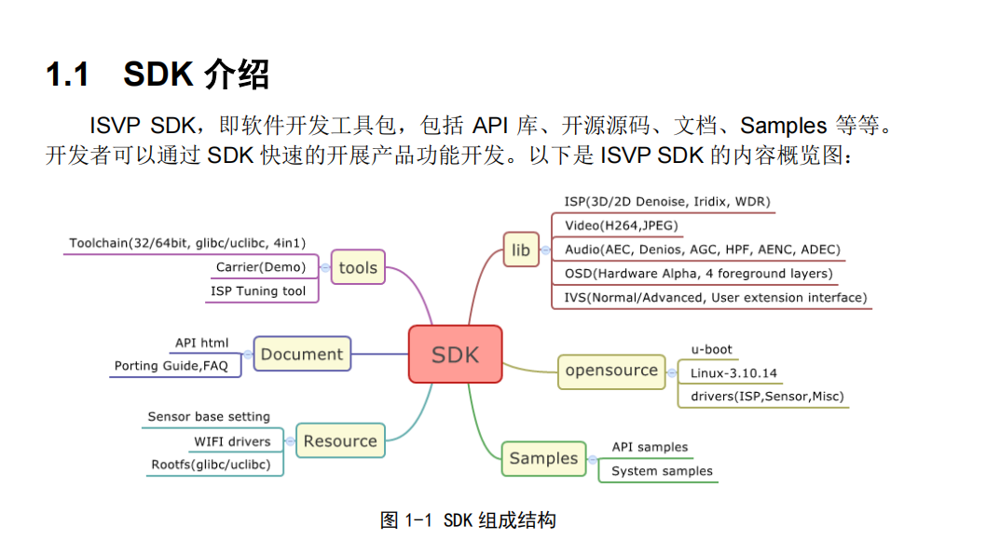
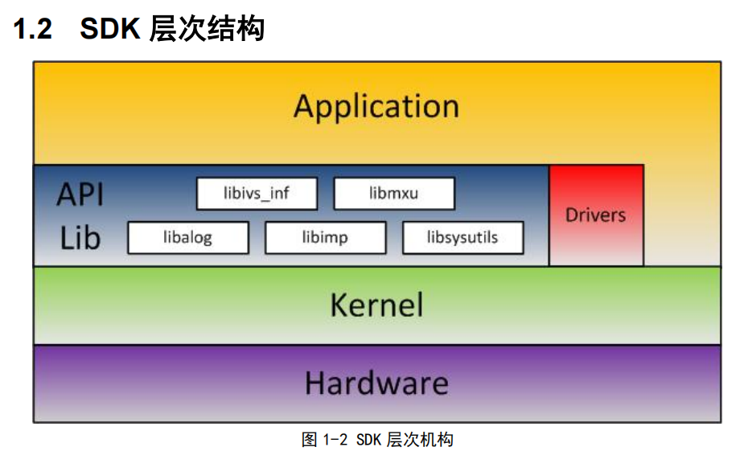
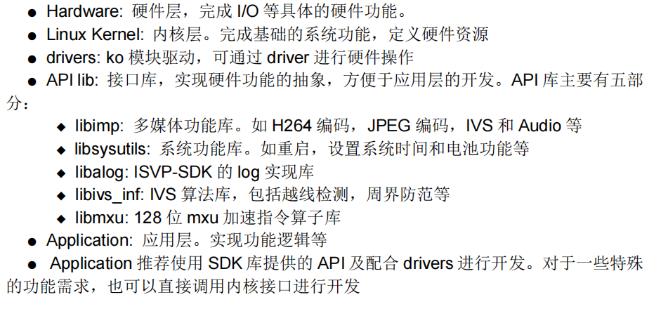

# **t31-tutorial**

* [获取交叉工具链](#获取交叉工具链)
* [编译&打包](#编译&打包)
* [固件烧录](#固件烧录)

## 获取交叉工具链

工具链位于T31官方SDK中, 建议联系原厂获取, 当然也可以邮件(pan3yao@gmail.com)获取(属于人工回复, 较慢)

以下SDK一些介绍







更多的帮助自行查看SDK里Doc, 也可以看看同目录下`官方文档`

## 编译&打包

```
. ./build/t31
make
./rootfs/t31/pack.sh
```

## 固件烧录
### linux内更新方法

首先把打包生成文件`rootfs.squashfs.img`和`appfs.jffs2.img`分别放在板子的`/tmp`下

1. rootfs : `flashcp -v  /tmp/rootfs.squashfs.img /dev/mtd2`
2. appfs : `mount -o ro,remount /board ; flash_eraseall /dev/mtd3 ; flashcp -v  /tmp/appfs.jffs2.img /dev/mtd3`
### uboot内更新方法

如果不小心烧录出错, 导致系统挂掉, 可以尝试uboot中更新方法。

TODO


# Q&A

1. 登录用户名/密码是多少?

   `root/hiviewV2`(其中`V`大写)

2. TODO