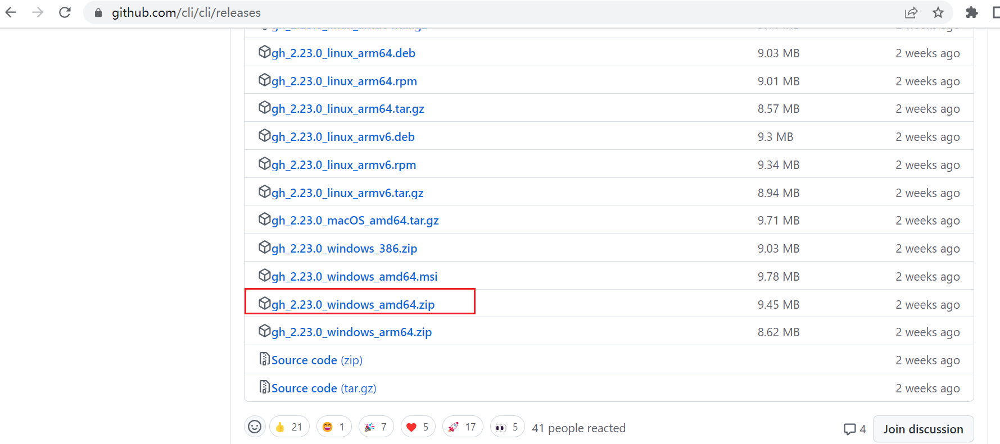
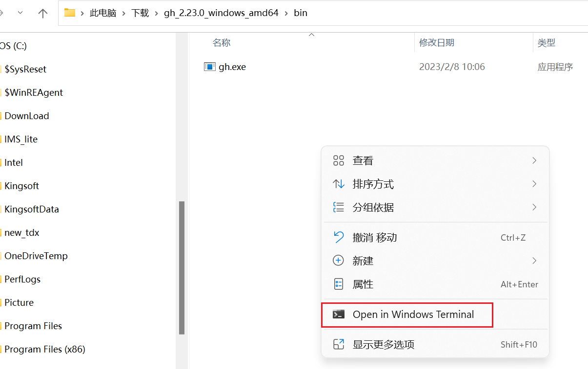
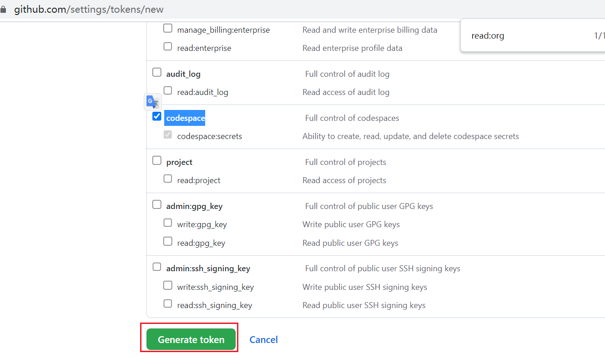
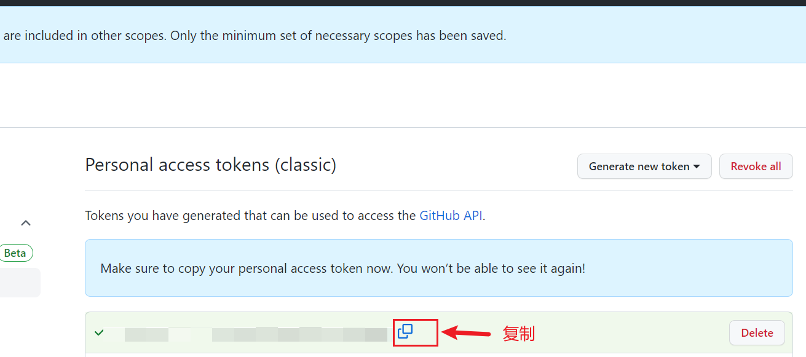
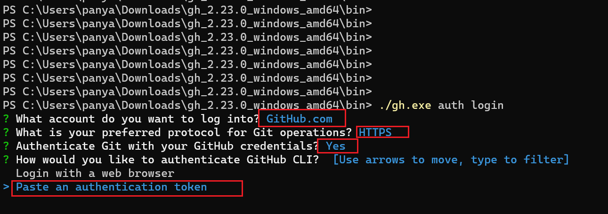
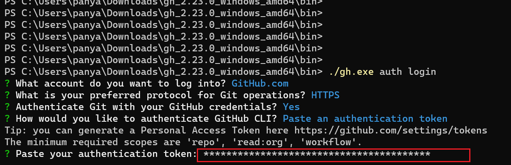
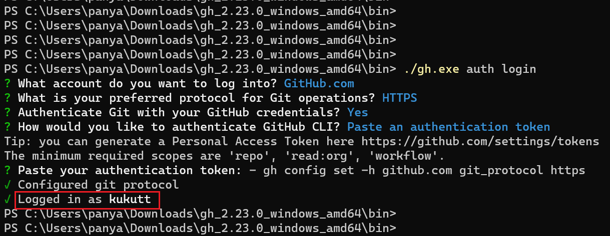
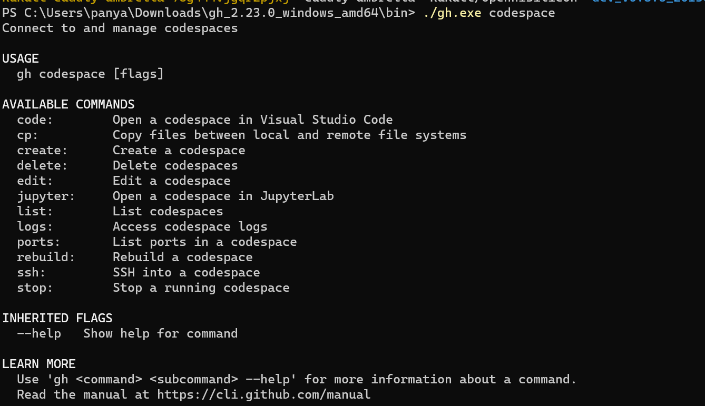

**白嫖方式搞个webrtc玩玩之codespaces里的网络摄像机之Github-CLI版本**

# 目的
之前写过一篇文章《[白嫖方式搞个webrtc玩玩之codespaces里的网络摄像机](https://github.com/kukutt/HIVIEW-V2/tree/main/Doc/%E7%99%BD%E5%AB%96%E6%96%B9%E5%BC%8F%E6%90%9E%E4%B8%AAwebrtc%E7%8E%A9%E7%8E%A9%E4%B9%8Bcodespaces%E9%87%8C%E7%9A%84%E7%BD%91%E7%BB%9C%E6%91%84%E5%83%8F%E6%9C%BA)》,基于windows下界面操作  

但是程序员还是较为喜欢命令行方式, 故再搞个命令行教程

# 参考资料
* [HIVIEW2](https://github.com/kukutt/HIVIEW-V2) : 基于openhisilicon/HIVIEW做了一些修改, 主要目的增加其他平台支持(第一站x86)
* [openhisilicon/HIVIEW](https://github.com/openhisilicon/HIVIEW) : 原始的开源网络摄像头项目（感谢提供这么优秀的项目）, 目前仅支持海思平台
* [视频教程](https://space.bilibili.com/582757748?spm_id_from=333.337.search-card.all.click) : 也是原项目作者的视频教程（再次感谢~）

# 准备Github-CLI环境(windows版)

* 到Github-CLI [releases](https://github.com/cli/cli/releases)界面下载[gh_2.23.0_windows_amd64.zip](https://github.com/cli/cli/releases/download/v2.23.0/gh_2.23.0_windows_amd64.zip)

  

* 解压并且利用`PowerShell`运行

  

* 登录[github开发者设置](https://github.com/settings/tokens)创建Token(classic)。最小权限`repo`, `read:org`, `workflow`, ` codespace`

  

  

* `PowerShell`里面执行登录`./gh.exe auth login`

  

  

  

到此，准备工作完成，其他平台操作基本类似。可以自行charGPT。

# 开始狂飙~

基本上GitHubCLI基于选择交互方式, 此处录个视频说明。可以输入`./gh.exe codespace`查看帮助



大体上步骤如下：

```
# 创建虚拟机
./gh.exe codespace create # kukutt/HIVIEW-V2 main
./gh.exe codespace ssh

# 虚拟机里面环境配置
sudo apt-get update
sudo apt-get install gcc-multilib g++-multilib build-essential module-assistant ffmpeg -y

# 编译
. ./build/x86
make

# 修改配置 & 运行
vi rootfs/x86/cfg/webs_parm.json
./rootfs/x86/run.sh

# 预览
https://kukutt.glitch.me/
```